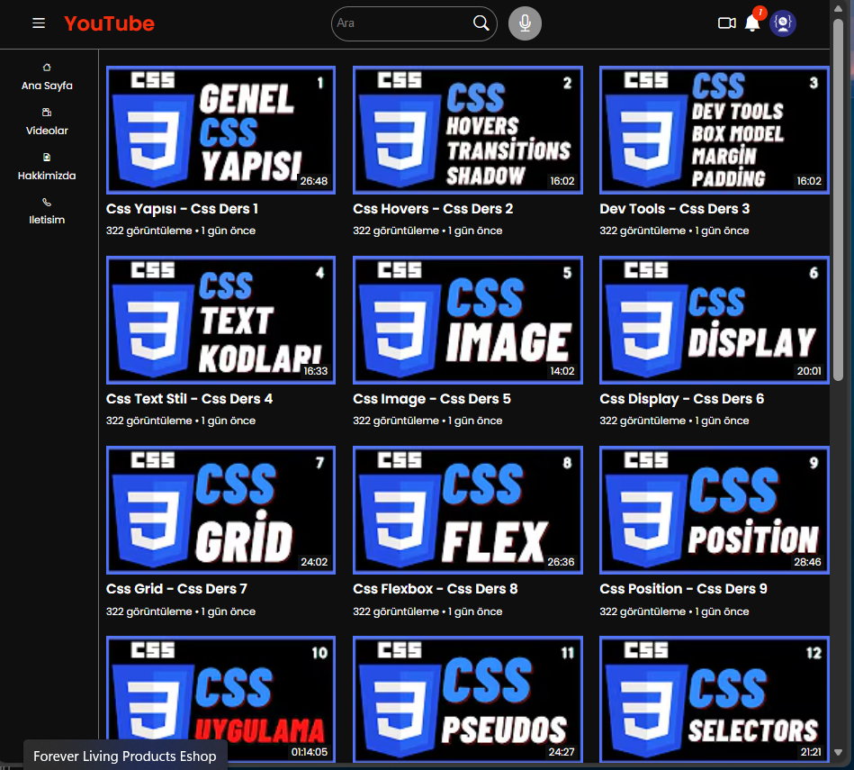
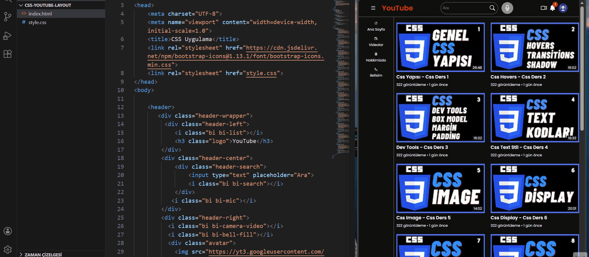

<!DOCTYPE html>
<html lang="tr">
<head>
<meta charset="UTF-8">
<title>css-youtube-layout</title>
</head>

<body>

<h1 align="center">🎬 css-youtube-layout</h1>

HTML ve CSS kullanılarak geliştirilen responsive YouTube arayüz klonu.
Frontend pratik ve layout çalışması amacıyla hazırlanmıştır.

<h2>📌 Proje Hakkında</h2>

Bu proje modern bir YouTube ana sayfa arayüzünün HTML ve CSS ile
yeniden oluşturulması amacıyla geliştirilmiştir.
Amaç; layout yapıları, grid sistemleri ve responsive tasarım
konularında pratik kazanmaktır.

<ul>
<li>Responsive tasarım</li>
<li>Sidebar navigasyon sistemi</li>
<li>Video grid layout</li>
<li>Header + arama alanı</li>
<li>Modern dark theme arayüz</li>
<li>Hover animasyonları</li>
</ul>

<h2>🛠 Kullanılan Teknolojiler</h2>

<ul>
<li>HTML5</li>
<li>CSS3</li>
<li>Flexbox</li>
<li>CSS Grid</li>
<li>Bootstrap Icons</li>
</ul>

<h2>📂 Proje Yapısı</h2>

<pre>
css-youtube-layout/
│
├── index.html
├── style.css
├── README.html
├── css.png
└── css.gif
</pre>

<h2>✨ Özellikler</h2>

<ul>
<li>YouTube benzeri modern arayüz</li>
<li>Responsive video kart sistemi</li>
<li>Hover efektleri</li>
<li>Sidebar navigasyon</li>
<li>Mobil uyumlu tasarım</li>
<li>Temiz ve okunabilir CSS yapısı</li>
</ul>

<h2>📸 Proje Önizleme</h2>

<h2>⚙️ Canlı Demo</h2>

<h2>👨‍💻 Geliştirici</h2>

<strong>Kenan Sönmez</strong> 
Frontend Developer Adayı

🔗 GitHub: 
<a href="https://github.com/kenansonmez1617-hub" target="_blank">
https://github.com/kenansonmez1617-hub
</a>

💼 LinkedIn: 
<a href="https://www.linkedin.com/in/kenan-sonmez" target="_blank">
https://www.linkedin.com/in/kenan-sonmez
</a>

<h2>📄 Lisans</h2>

Bu proje eğitim amaçlı geliştirilmiştir.
Serbestçe kullanılabilir ve geliştirilebilir.

⭐ Eğer projeyi beğendiyseniz yıldız vermeyi unutmayın!

</body>
</html>
